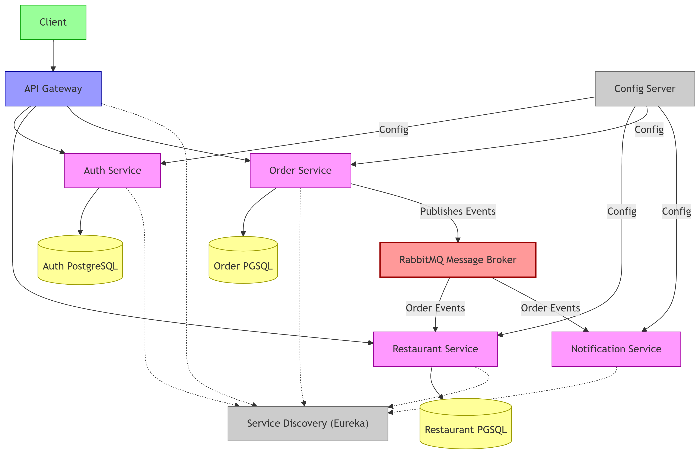
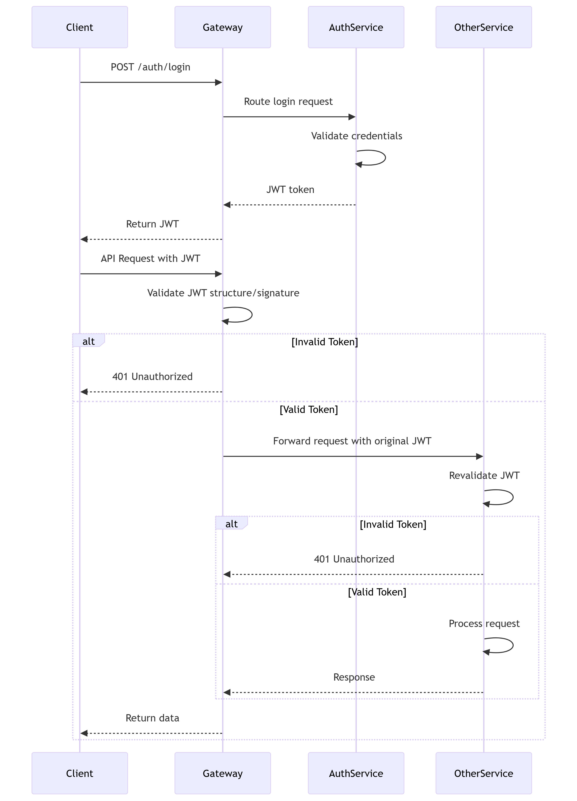
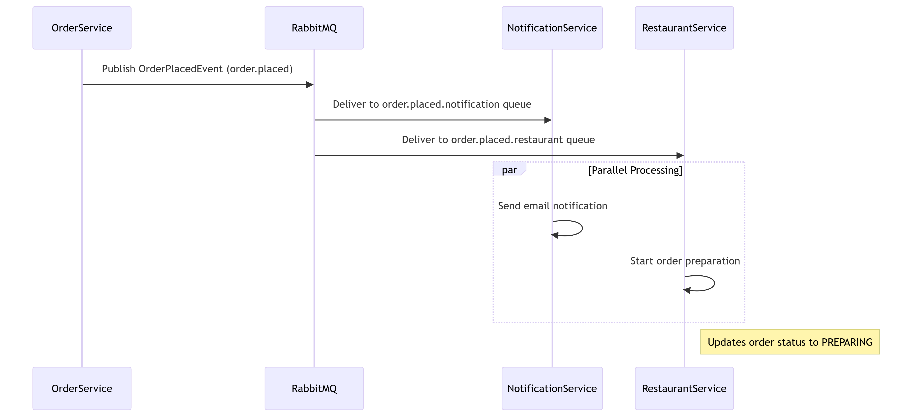

# ByteBites Food Delivery Platform

## Table of Contents
1. [System Overview](#system-overview)
2. [Setup Instructions](#setup-instructions)
3. [Testing Flows](#testing-flows)
4. [Service Startup Order](#service-startup-order)
5. [API Documentation](#api-documentation)
6. [Architecture Diagrams](#architecture-diagrams)

---

## System Overview

ByteBites is a microservices-based online food delivery platform that offers:

- **JWT-based authentication**
- **Role-based access control**
- **Event-driven communication with RabbitMQ**
- **Service discovery via Eureka**

---

## Setup Instructions

### Prerequisites

- **Docker** & **Docker Compose**
- **JDK 17+**
- **Maven 3.8+**

### Clone the Repository

```bash
git clone https://github.com/eliasonic/bytebites.git
cd bytebites
```

### Start Infrastructure Services

```bash
docker-compose up -d postgres rabbitmq
```

### Build and Start Microservices

> **Note:** Each service should be started in a separate terminal.

```bash
# Build all services
mvn clean install

# Start Discovery Server
java -jar eureka-server/target/*.jar

# Start Config Server
java -jar config-server/target/*.jar

# Start API Gateway
java -jar api-gateway/target/*.jar

# Start Auth Service
java -jar auth-service/target/*.jar

# Start other services similarly
```

---

## Testing Flows
---

### Order Placement Flow

1. **Login to Obtain JWT**

   ```
   POST /auth/login
   ```

2. **Retrieve Restaurant Options**

   ```
   GET /api/restaurants
   ```

3. **Place an Order**

   ```
   POST /api/orders
   ```
---

### Restaurant Management Flow

1. **Login as Restaurant Owner**

2. **Create a New Restaurant**

   ```
   POST /api/restaurants
   ```

3. **Add Menu Items**

   ```
   POST /api/restaurants/{restaurantId}/menu-items
   ```

---

## Service Startup Order

Start services in this order to avoid dependency issues:

1. Database (PostgreSQL)
2. Message Broker (RabbitMQ)
3. Discovery Server (Eureka)
4. Config Server
5. API Gateway
6. Auth Service
7. Restaurant Service
8. Order Service
9. Notification Service

---

## API Documentation

Each microservice exposes Swagger UI:

- **Auth Service:** [http://localhost:8081/swagger-ui.html](http://localhost:8081/swagger-ui.html)
- **Restaurant Service:** [http://localhost:8082/swagger-ui.html](http://localhost:8082/swagger-ui.html)
- **Order Service:** [http://localhost:8083/swagger-ui.html](http://localhost:8083/swagger-ui.html)

---

## Architecture Diagrams

**1. High-Level System Architecture**



**2. Authentication Flow Diagram**



**3. RabbitMQ Event Flow Diagram**



---
